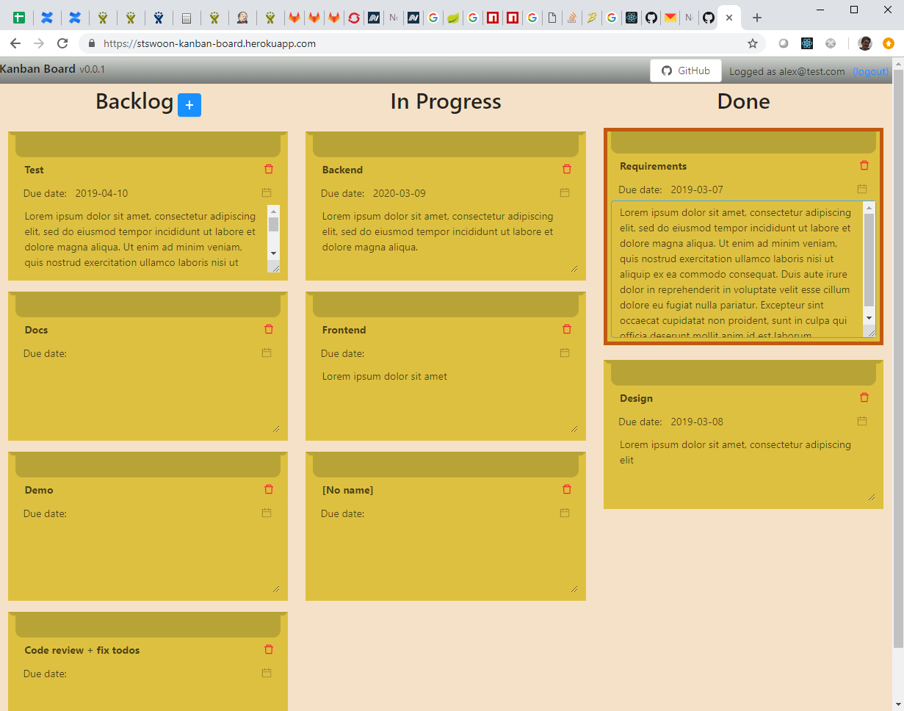
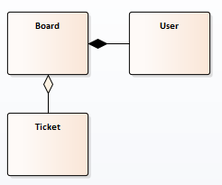
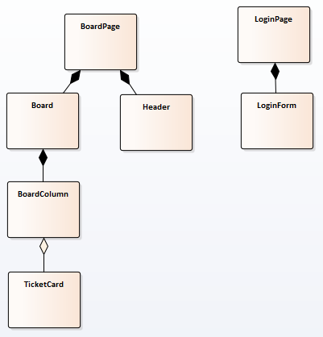
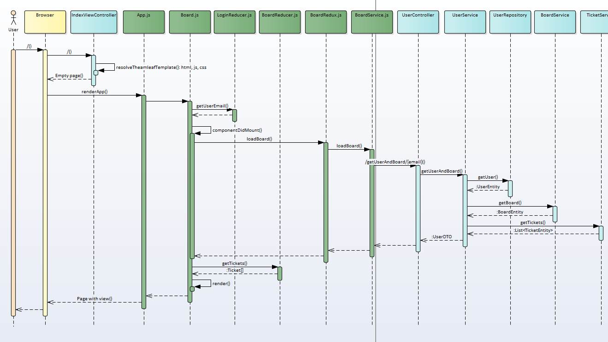

# Kanban Board
Аппликейшен в интернете - https://stswoon-kanban-board.herokuapp.com

## Задача
Разработайте клиент-серверное приложения реализующее Канбан-доску.

## Требования
В связи с тем, что задача является тестовым заданием и время на выполнение задачи ожидается в объеме 24h
то мною были заданы или исключены дополнительно следующие требования и технические моменты:  
1. Backend: Java + Spring Boot
1. Frontend: React + Router + Redux + Antd
1. RestFull service 
1. Security **out-of-scope** 
1. Localization **out-of-scope** (не успел)
1. Sharing work **out-of-scope**
1. Offline work **out-of-scope**
1. Mobile html **out-of-scope**
1. Ticket Ordering внутри одной колонке 
1. Using Optimistic UI (т.к. запросы достаточно быстро обрабатываются, экран не блокируется overlay, в идеале список запросов нужно ставить в очередь, но также не успел уже сделать)
1. WebSockets **out-of-scope**
1. Docs (небольшая документация описанна в этом readme файле)
1. Tests (только несколько простых тестов)
    1. Unit tests для back и front
    1. Integration tests, например Test Cafe
    1. Screenshot tests **out-of-scope**
1. *CI **out-of-scope**
1. SSR **out-of-scope**
1. Optimization **out-of-scope** (оптимизации бандла, PureComponents, shouldUpdate и др)
1. Support Edge, FF, CH
   1. IE11 **out-of-scope** (нужно подключить полифилы)
1. Локальное тестирование сделано через запуск front и back в дев режиме, полноценного стабового сервера на express не делалось.  
1. Deploing to Heroku (https://stswoon-kanban-board.herokuapp.com, т.к. бесплатный аккаунт первый запуск длится пол минуты)

Некоторые фичи такие как авторизация, SSR, преформанс я делал в своем домашнем проекте - https://github.com/stswoon/financeManager

## Фичи в коде
### Back
1. Подключено кеширование статических ресурсов
1. Подключен ETag чтобы не пересылать Body
1. При старте приложения разворачивается TestData
1. Для локального девелопмента используется local профайл с sqlLite базой, для prod подключение к Heroku Postgre
1. Для тикетов нет особых требований, поэтому используется дефолтный контроллер, который предоставляет Rest Repository (но наверно лучше было бы сделать свой)
1. Тесты юнит и компонентные - BoardServiceTest и TicketControllerTest соответственно
1. Ручное интеграционное бекенд тестирование можно сделать через запросы в папке /http

### Front 
1. Локальное тестирование на стабах - BoardTest.js
1. HttpService.js - сервис для http запросов
1. strings.js - вынесенны все текстовые константы
1. LoginForm.js - имеет валидацию данных
1. TicketCard.js - имеет debounce чтобы не созранять на сервер каждый символ
1. BoardColumn.js - для разделения обязанностей Board
1. BoardService.js - взаимодействие с беком.
1. Board.js - при изменени тикета отпрявляется апдейт только тикета, при перемещщении тикета отправляется весь борд, т.к., в общем случае, нужно одновить ордер для всех тикетов.
1. Тест сервиса и компоненты - BoardService.test.js и TicketCard.test.js соответственно
1. Добавлена анимация при наведении на тикет (всплытие чуть вверх и обводка рамки)

## Планирование
Потрачено времени ~23h (из 24h) - https://github.com/stswoon/kanbanBoard/issues?q=is%3Aissue+is%3Aclosed

## Диаграммы
 
Диаграмма сущностей бекенда

Диаграмма компонент фронтенда

Диаграмма применой последовательности при получении тикетов для залогиненного юзера

